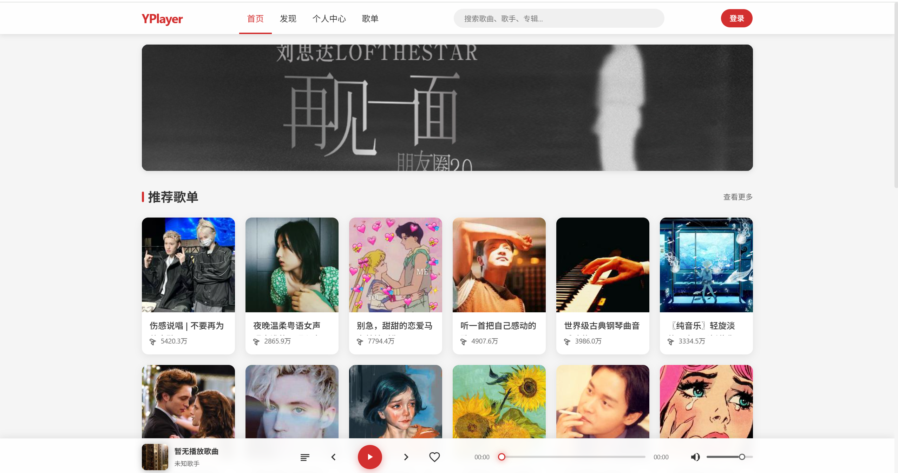
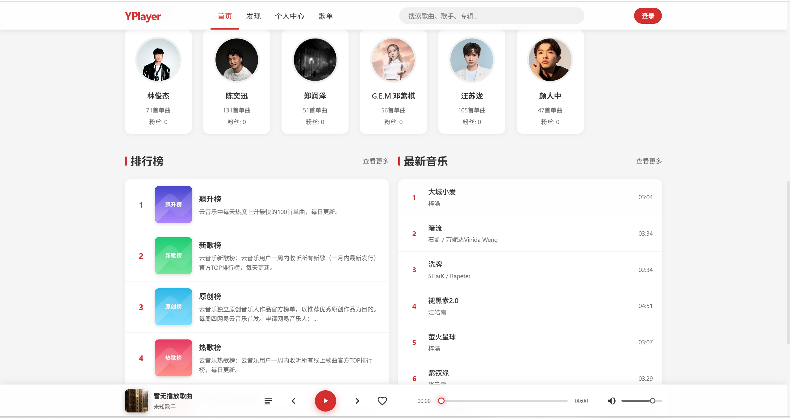

# YPlayer - 网易云音乐网页播放器

YPlayer是一个基于网易云音乐API的现代化、轻量级网页音乐播放器，具备音乐播放、歌单管理、个人中心等功能，同时确保移动端与桌面端的良好兼容性。

## 更新日志

### v0.0.1 (2025-08-07)
- 初始化项目
- 增加首页、搜索及音乐播放

### v0.0.2 (2025-08-09)
- 增加搜索页面
- 实现关键词搜索

### v0.0.3 (2025-08-12)
- 搜索、登录组件化
- 增加二维码登录

### v0.0.4 (2025-08-13)
- 封装axios接口
- 菜单改成为我推荐、发现音乐和播客电台

### v0.0.4 (2025-08-22)
- 增加个人中心页面及其子页面并实现跳转
- 实现cookie登录的数据抓取和部分数据使用（用户名，头像）

## 技术栈

- **前端框架**: Vue.js
- **UI框架**: Ant Design for Vue
- **状态管理**: Pinia
- **API请求**: Axios
- **音频处理**: Howler.js
- **构建工具**: Vite
- **代码规范**: ESLint, Prettier
- **版本控制**: Git
- **路由管理**: Vue Router

## 核心功能模块

### 1. 为我推荐
- 个性化推荐歌单
- 每日推荐歌曲
- 基于听歌偏好的智能推荐
- 热门音乐推荐

### 2. 发现音乐
- 歌单广场（各类主题歌单）
- 排行榜（热门歌曲排行）
- 歌手列表
- 新歌速递
- 音乐搜索功能

### 3. 播客电台
- 热门播客推荐
- 播客分类浏览
- 播客播放与订阅

### 4. 个人中心
- 具体功能实现尽请期待

## 项目结构

```
Yplayer/
├── .github/
│   └── workflows/
│       └── deploy.yml
├── .gitignore
├── .vscode/
│   └── extensions.json
├── README.md
├── dist/
│   ├── assets/
│   ├── index.html
│   └── vite.svg
├── img/
│   ├── 1.png
│   ├── 2.png
│   └── 3.png
├── index.html
├── package-lock.json
├── package.json
├── prompt.md
├── public/
│   └── vite.svg
├── src/
│   ├── App.vue
│   ├── api/
│   │   ├── album.js
│   │   ├── artist.js
│   │   ├── banner.js
│   │   ├── comment.js
│   │   ├── index.js
│   │   ├── playlist.js
│   │   ├── qrLogin.js
│   │   ├── radio.js
│   │   ├── recommend.js
│   │   ├── request.js
│   │   ├── search.js
│   │   ├── song.js
│   │   ├── topList.js
│   │   └── user.js
│   ├── api.js
│   ├── assets/
│   │   ├── search.svg
│   │   └── vue.svg
│   ├── components/
│   │   ├── HelloWorld.vue
│   │   ├── Login.vue
│   │   ├── Navbar.vue
│   │   ├── PlayerBar.vue
│   │   └── QRLogin.vue
│   ├── main.js
│   ├── router/
│   │   └── index.js
│   ├── store/
│   │   ├── discover.js
│   │   ├── player.js
│   │   ├── recommend.js
│   │   └── user.js
│   ├── style.css
│   ├── test.vue
│   ├── utils/
│   │   ├── auth.js
│   │   ├── errorCode.js
│   │   └── request.js
│   └── views/
│       ├── Discover.vue
│       ├── Home.vue
│       ├── Player.vue
│       ├── PlaylistDetail.vue
│       ├── PodcastRadio.vue
│       ├── Search.vue
│       ├── UserProfile.vue
│       ├── discover/
│       │   ├── Artists.vue
│       │   ├── NewMusic.vue
│       │   ├── Playlists.vue
│       │   └── Toplists.vue
│       └── usercenter/
│           ├── CollectMusicList.vue
│           ├── CreateMusicList.vue
│           ├── MyCollect.vue
│           ├── Menu.vue
│           ├── MyLike.vue
│           └── RecentlyPlay.vue
└── vite.config.js
```

## 开发指南

### 环境准备
1. 确保已安装Node.js (v16+) 和 npm
2. 克隆项目到本地
3. 安装依赖
   ```bash
   npm install
   ```

### 开发运行
```bash
npm run dev
```

### 构建生产版本
```bash
npm run build
```

### 代码规范
- 使用ES6+语法
- 组件化开发，拆分合理
- 函数式编程风格
- 清晰的代码注释 (公共组件、工具函数、关键逻辑)
- 避免冗余代码
- 命名规范统一 (驼峰命名法)

## API集成
本项目基于网易云音乐NodeJS API (https://music163-jet.vercel.app) 开发，通过Vite的代理功能避免跨域问题。

## 注意事项
- 遵守网易云音乐API使用规范
- 确保用户数据安全
- 处理网络异常与离线情况
- 考虑低性能设备的体验优化
- 代码可维护性与扩展性

## 项目展示

